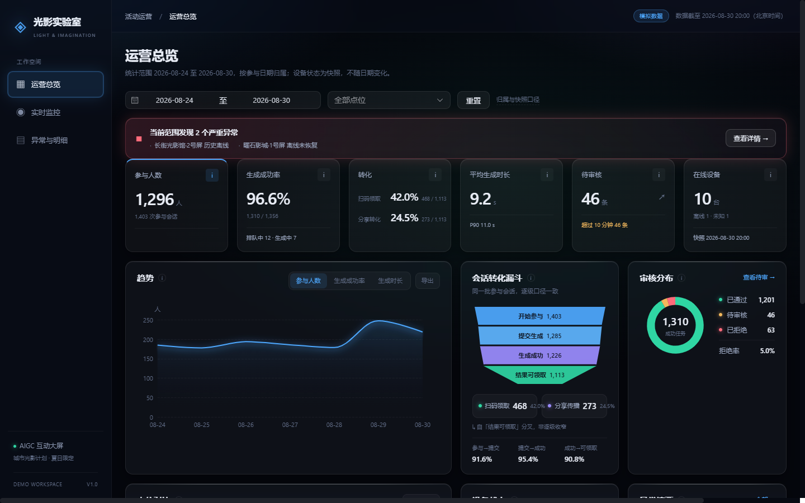
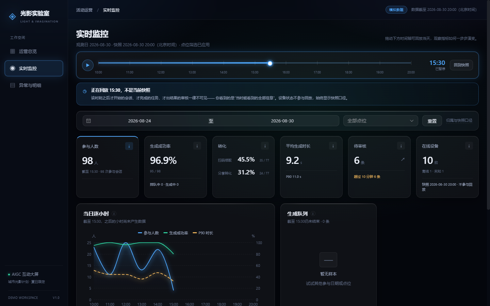
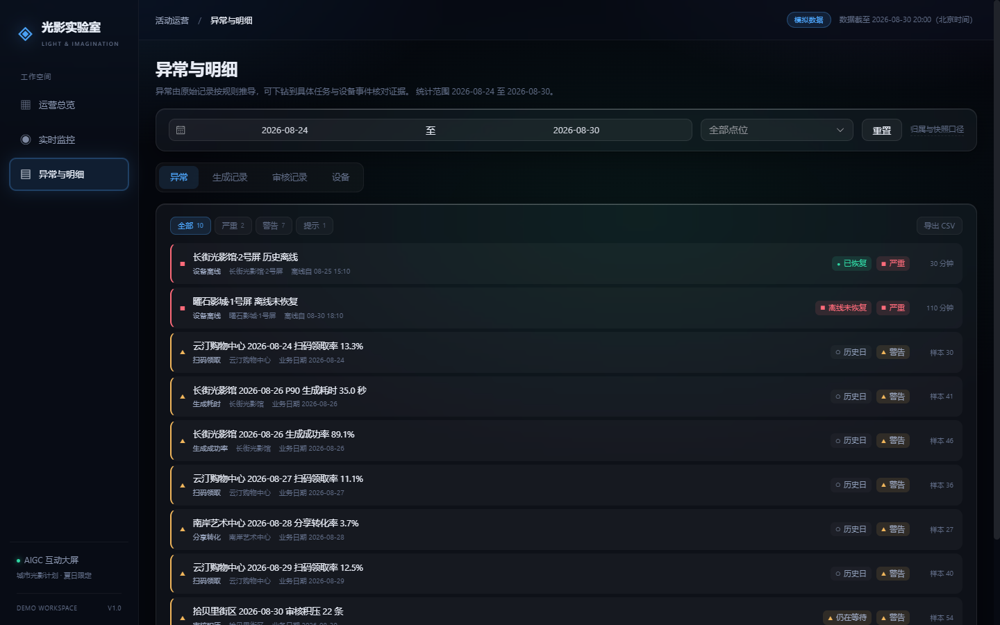

# AIGC 互动大屏运营看板

**一个面向 AI 生成类产品的运营监控参考实现。** 不只是把图画出来，而是把「该看哪些指标、每个指标的分母怎么定、异常怎么从原始记录推导出来」这套东西做成可运行的代码。

[](https://github.com/zcinta0514/aigc-ops-dashboard/actions/workflows/ci.yml)




---

## 这个项目解决什么问题

做 AIGC 产品的团队迟早要回答这几个问题，而它们**没有标准答案**：

- 生成成功率的分母，要不要算上还在排队和生成中的任务？
- 「平均生成时长 9 秒，看着很正常」——那如果 P90 已经到 35 秒了呢？
- 用户扫码领取和分享转发，能不能合成一个「转化率」？
- 十几个点位的成功率，能不能取平均就是全局成功率？
- 告警响了，运营怎么知道该信不信？

这个仓库给出的是一套**经过推敲的答案 + 可直接运行的实现**。领域计算层与界面完全解耦，换成你自己的数据源即可复用。

### 四个值得单独说的口径决定

**1. 生成耗时异常按 P90 判定，不按平均值**

生成时长是典型长尾分布，少数超时任务会被大量正常样本稀释掉。仓库里植入了这样一个场景（长街光影馆 8-26）：当天**平均耗时约 9 秒仍在正常区间，P90 却已达 35 秒**。只看均值，这个异常永远不会被发现。

**2. 扫码领取率与分享转化率分列，不合并**

两者分母相同（可领取会话），但**互不包含**——用户可能直接分享而不扫码。南岸艺术中心 8-28 就是专门构造的反例：当天扫码领取率 44% 正常，分享转化率仅 3.7%。**如果合并成一个「转化率」，这个异常会被高值拉平，彻底消失。**

**3. 排队中与生成中的任务不计入成功率分母**

否则分母被未完结的工作撑大，成功率被系统性低估。代价是这些任务会「消失」在指标里，所以成功率卡片必须**单独列出这两个数量**。

**4. 分位数不能平均**

分位数不是线性统计量。各点位的 P90 取平均，数学上没有意义。所有汇总——人数、比率、均值、分位数——都必须**从合并后的原始样本重算**。

完整的口径定义见 [`docs/METRICS.md`](docs/METRICS.md)，数据结构见 [`docs/DATA_SCHEMA.md`](docs/DATA_SCHEMA.md)。

---

## 快速开始

```bash
npm ci
npm run dev          # http://127.0.0.1:5173
```

无需后端、数据库或任何 API Key——模拟数据在构建时内联进产物。

其他常用命令：

| 命令 | 用途 |
| --- | --- |
| `npm run verify` | 完整校验链：数据校验 → 复现校验 → lint → 类型检查 → 单测 → 构建 |
| `npm run test:unit` | 72 条单元测试，单次运行 |
| `npm run test:e2e` | 9 条端到端测试，覆盖三个页面的关键路径 |
| `npm run data:generate` | 重新生成固定种子的模拟数据并更新 manifest |
| `npm run data:validate` | 只校验磁盘上的数据，不重新生成 |
| `npm run build:single` | 产出可直接双击打开的单文件 HTML |
| `npm start:demo` | 构建并预览，用于演示 |

---

## 三个页面

| 页面 | 用途 |
| --- | --- |
| **运营总览** `#/overview` | 时间段复盘：七类指标、趋势（均值与 P90 同轴对比）、六段会话漏斗、点位对比、审核分布、设备状态、异常摘要 |
| **实时监控** `#/live` | 当日截面：**时间回放**、逐小时趋势、生成队列、待审队列、设备网格 |
| **异常与明细** `#/details` | 证据核对：异常列表、生成记录、审核记录、设备快照与历史离线事件，均可下钻到任务与设备详情 |

### 时间回放



拖动时间轴（或点播放）可回放当天，**所有指标按那一刻重算**：尚未开始的会话不出现，尚未完成的任务回到「生成中」，尚未出结果的审核一律不可见。

这不是把当前数字换个时间标签——领域层会把每条记录**还原成它在那一刻的样子**。回放中最后一段是「进行中」的小时，图上会明确标出，避免把「这个小时还没走完」误读成「参与人数骤降」。

### 异常可下钻核对证据



每条异常都由原始记录按规则推导，**不存在硬编码的假告警**。异常详情给出触发规则、实际值、阈值、分子分母、样本量与关联任务 ID，并明确声明「规则输出不等于已确认根因」。

---

## 接入你自己的数据

领域计算层只认识一种输入形状——`Dataset`。换成你自己的数据源，**只需要改一行**：

```ts
// src/data/repository.ts
export const dataSource: DataSource = createFetchSource({
  baseUrl: '/api/dashboard',
  // 默认文件名与 data/mock/v1 一致，接口不同时在这里映射
})
```

`DataSource` 接口在 [`src/data/source.ts`](src/data/source.ts) 里，已提供两种实现：构建时内联的静态数据、HTTP 接口。接真实后端时可在 `createFetchSource` 基础上加鉴权、分页与重试。

改品牌名、导航项与文案，只需改 [`src/config/brand.ts`](src/config/brand.ts) 一个文件；演示日期在 [`src/config/demo.ts`](src/config/demo.ts)；异常阈值集中在 [`src/config/thresholds.ts`](src/config/thresholds.ts)。

数据字段定义见 [`docs/DATA_SCHEMA.md`](docs/DATA_SCHEMA.md)——**其中的约束不是装饰**，`npm run data:validate` 会逐条校验（外键完整性、时间顺序、离线区间不重叠、非成功任务不得出现审核结论等）。

---

## 项目结构

```text
data/mock/v1/         模拟数据，构建时内联
scripts/generator/    固定种子生成器（含受控异常配额）
scripts/              数据校验与复现校验
src/domain/           时间、会话集合、指标、分位数、设备状态、异常推导
src/data/             数据源抽象与实现
src/config/           品牌、演示日期、异常阈值
src/composables/      筛选状态、图表生命周期、导出
src/features/         页面区块与抽屉
src/pages/            三个页面
src/styles/           设计令牌、全局样式、ECharts 主题
tests/                独立小样本单测
docs/                 指标合同与数据结构规范
```

### 分层原则

`src/domain/` 是纯 TypeScript，**不依赖 Vue、DOM、路由或图表库**。所有指标计算都可以脱离界面单独测试——这也是 72 条单测能存在的前提。

---

## 模拟数据是怎么造的

数据不是随机生成的，是按**配额**构造的：

- 固定种子 `aigc-ops-demo-v1`，重复生成**逐字节一致**（`npm run data:verify` 可自行验证）
- 6 个点位、12 台设备、6,000 条会话、4,500 个去重参与者，数量精确
- 植入了 5 个受控异常场景，生成器**逐条断言必须命中**，不靠换种子碰运气
- 生成与校验的日志、以及分位数算法的独立核对记录，见各脚本输出

异常场景清单见 [`docs/DATA_SCHEMA.md`](docs/DATA_SCHEMA.md) 的「受控异常」一节。**每一个都能在界面上找到，并下钻到具体任务核对。**

---

## 测试

```bash
npm run test:unit    # 72 条，单次运行
npm run test:e2e     # 9 条，需先安装浏览器
```

单元测试覆盖的是最容易出错、也最难在界面上看出来的地方：

- 去重（跨日跨点位同一人只算一人）
- 跨日归属（任务在次日完成，仍归属会话开始那天）
- 合并汇总（**不能平均各点位的百分比**）
- 分位数（**不能平均各点位的 P90**，且插值口径与 NumPy 对齐）
- 零分母（显示 `—`，不是 `0`，不产生 NaN）
- 异常阈值边界（恰好等于阈值不触发；样本量不足不告警）
- 设备在线判定的 119 / 120 / 121 秒边界

**所有期望值都是独立手算后写死的，没有一条通过调用被测函数反算得到。**

端到端测试覆盖三个页面的关键路径：首屏渲染真实指标、筛选真的生效、时间回放真的重算、异常真的能下钻、无效参数真的有反馈。它会**收集控制台错误并断言为空**——页面 silently 报错时测试应当失败，而不是只截个图了事。

---

## 已知限制

- **数据是固定快照，不是实时流。** 观察截至 2026-08-30 20:00，实时监控页顶部已明确标注。回放是对既有事件的重演，不是模拟新数据。
- **不接入真实 AI 生成、审核服务或设备控制。** 页面上不出现「重启设备」「重新派单」这类无法真正执行的按钮。
- **阈值均为演示参数**（95% / 20% / 20 秒 / 10 分钟 / 120 秒），不是生产 SLA，上线前需按实际业务定标。
- **设备状态只有最后一次心跳**，没有心跳历史，因此该面板固定为快照口径，不参与时间回放。
- 参与者去重依赖模拟匿名 ID。真实系统能否跨点位识别同一人，本原型不作假设。

---

## 技术栈

Vue 3 · TypeScript（strict）· Vite · Element Plus · Tailwind CSS · Apache ECharts · Vitest

界面为深色玻璃主题，图表使用自定义 ECharts 主题而非默认色板。设计令牌集中在 `src/styles/tokens.css`，页面与组件中不出现硬编码色值。

---

## License

[MIT](LICENSE)
